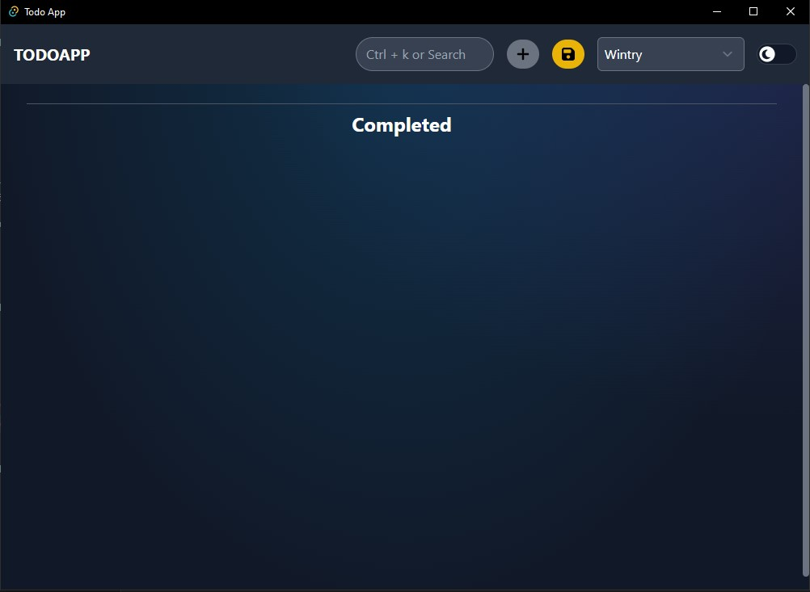
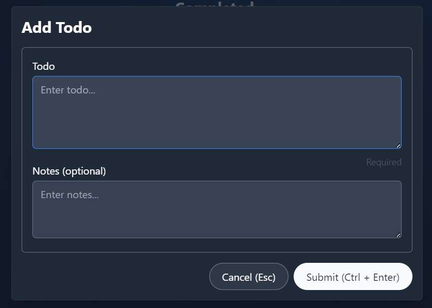
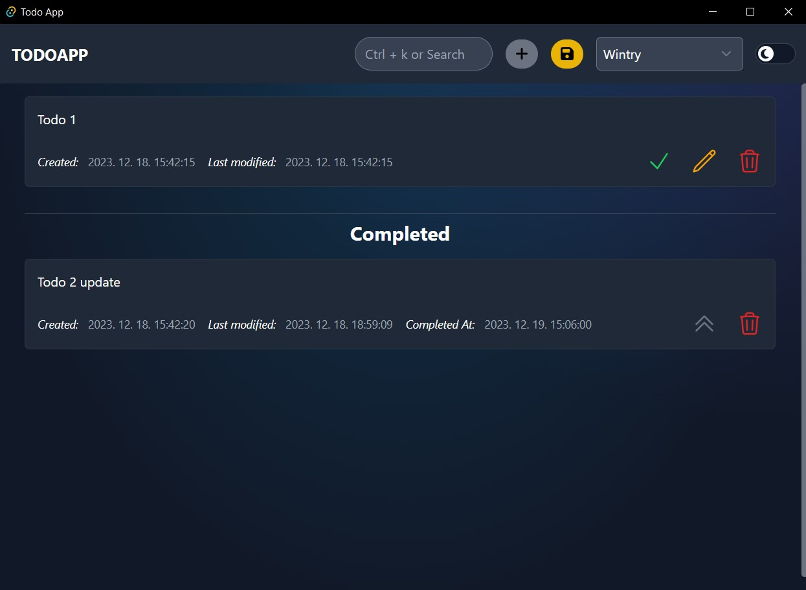

# Todo App

This is a todo application, which made for my personal usage.

I used [Skeleton](https://www.skeleton.dev/) (Sveltekit) for frontend, and [Tauri](https://tauri.app/) (Rust) for backend. Why Sveltekit? Because i wanted to test it in 'real'. And why i choosed Tauri? Because i wanted a desktop app, and because i also wanted try Rust. I doesn't use any database, but i save todos into a json.

## Usage

After first start, a todos.json will be created with empty todos list.



Features:

- Search field or <kbd>Ctrl + k</kbd>: filtering todos
- Plus button or <kbd>Ctrl + n</kbd>: adding new todo
- Save button or <kbd>Ctrl + s</kbd>: saving todos
- Theme changing: use selection
- Toggle light/dark theme: use toggle button

Adding or editing todo:



After adding and completing todos:



Todo:

- completing todo whit green check button
- editing with yellow pen button
- deleting with red trash button
- uncompleting with double-caret-up button

## Sveltekit

### Developing

Once you've created a project and installed dependencies with `npm install` (or `pnpm install` or `yarn`), start a development server:

```bash
npm run dev

# or start the server and open the app in a new browser tab
npm run dev -- --open
```

### Building

To create a production version of your app:

```bash
npm run build
```

You can preview the production build with `npm run preview`.

> To deploy your app, you may need to install an [adapter](https://kit.svelte.dev/docs/adapters) for your target environment.

## Tauri

For installing Tauri for Sveltekit use documentation found here: [Tauri-Sveltekit Docs](https://tauri.app/v1/guides/getting-started/setup/sveltekit/)

My app contains everything to getting started.

### Developing

```bash
cargo tauri dev
```

### Building

```bash
cargo tauri build
```
